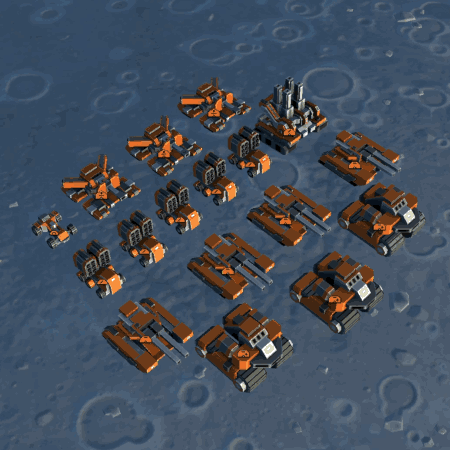

# CycleSelect / TabSelect

A simple in-game UI/UX mod for [*Planetary Annihilation: Titans*.](https://planetaryannihilation.com/)

It **provides the ability to '*cycle-select*' or 'tabbing' between multiple unit types of the current selection** via a new hotkey named; "Cycle (Forward/Backwards) Through Selection".

## Motivation

As far as I know, vanilla PA:T doesn't provide a unit-control option like this, and I felt like this was missing in my gameplay. So, this mod **adds an alternative method of relatively quickly selecting units of a specific type** in the current selection, without having to double-click (tiny) unit icons, or using another mod such as '*Hotbuild2*' – which changes the default unit hotkey setup a lot more.

I have spent quite some time playing StarCraft 2 in the past, and I used 'tabbing' a lot for production facilities (or for units with different abilities) like shown in [this video](https://youtu.be/BvoainJ_U_c?si=PPZHpzU1IENT3P5N&t=93). Thus, this mod is inspired by that feature. Maybe not ideal for PA:T with a huge variety of unit types, but I have noticed that it's better than not having the option.

## How it works in-game

1. **Select multiple types of units.** Either by box-selecting, using control groups, or via the "select-all" hotkeys, etc.
2. Then **pressing the *cycle-select* hotkey will select all the units of the first unit type in the selection list**. (I personally use the 'tab-key' for this.)
3. **Pressing it again, will select the next unit type** in the selection list.
4. **At the end of the list**, the next *cycle-select* **will loop back to the first unit type**.
5. This process is reversed when going backwards in the selection list.

### Technical Details

- Whenever the user selects units, the selection list is saved via a selection callback function.
- Performing a *cycle-select* will select all units of a singular unit type in the selection list. (It will not reset the saved selection list.) Performing another *cycle-select* will select the next units of a singular unit type in the list.
- When the end of the unit type list is reached, the next *cycle-select* will go back to the first unit type group in the list.
- The saved selection list be reset, only when box-selecting new units, recalling control groups, losing the units by destruction, or using the "select-all" hotkeys.
- As of right now, the unit type cycle order/priority is determined by the game itself, and is – most of the time – consistent with what you see in the selection list UI.

* **CycleSelect Example**; Selection = ABCD, so cycle-selecting will be:
  * UoT ABCD -> UoT A -> UoT B -> UoT C -> UoT D -> UoT A. *(UoT = Units of Type)*

## Installation

You can **install the "CycleSelect" mod via the in-game "*Community Mods*" menu**, or you can install it locally by copying the mod contents in the appropriate "*client_mods*" folder.

## Future Ideas

- Cycle-selecting from the last unit type, could *cycle-select* back to the entire selection, instead of going to the first unit type in the list. Could possibly add this as an option in the settings.
- Currently, there is no way to customize the *cycle-select* order/priority regarding unit types, but should be doable. Though this will add some complexity.
- There is also currently no way to group certain units in the cycle-selection, but should be doable. It will add some complexity. E.g. grouping "Hummingbirds" and "Phoenixes" in one, or units like "Doxes" and "Slammers".
- At the moment, when performing a *cycle-select*, the unit list UI will of course only show the currently selected units, but it would be nice to keep all the unit types shown in the selection list UI, and then having the current cycle-selected unit type highlighted in the list. (For instance, with a different colour, and a bold outline.)
